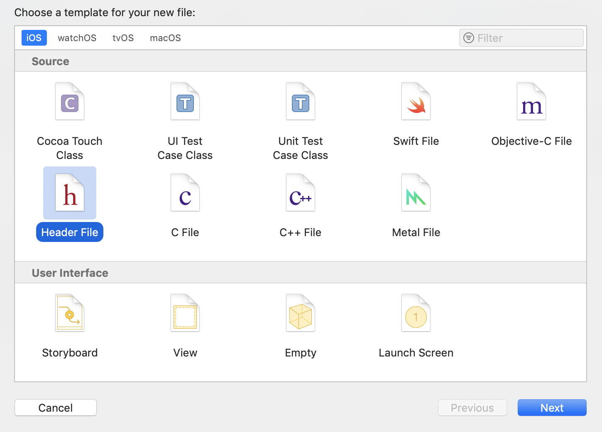
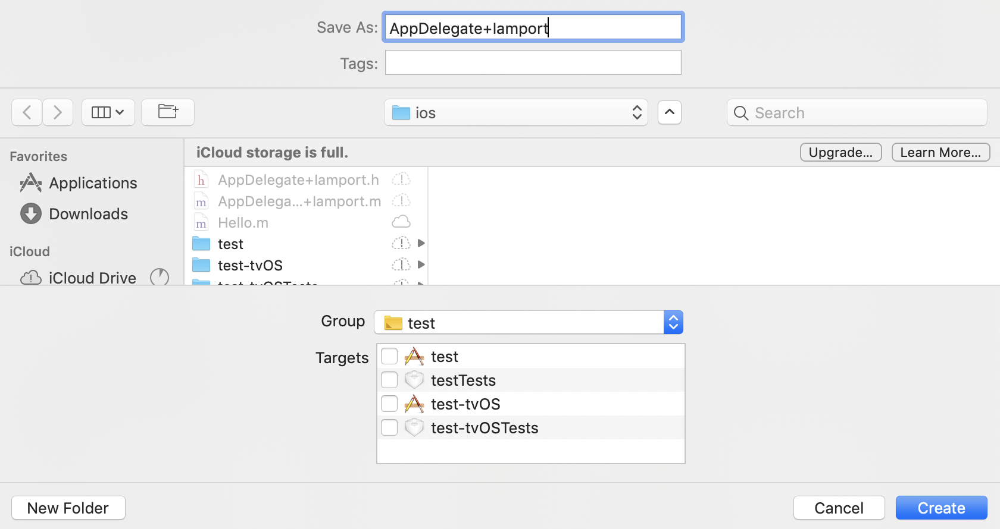
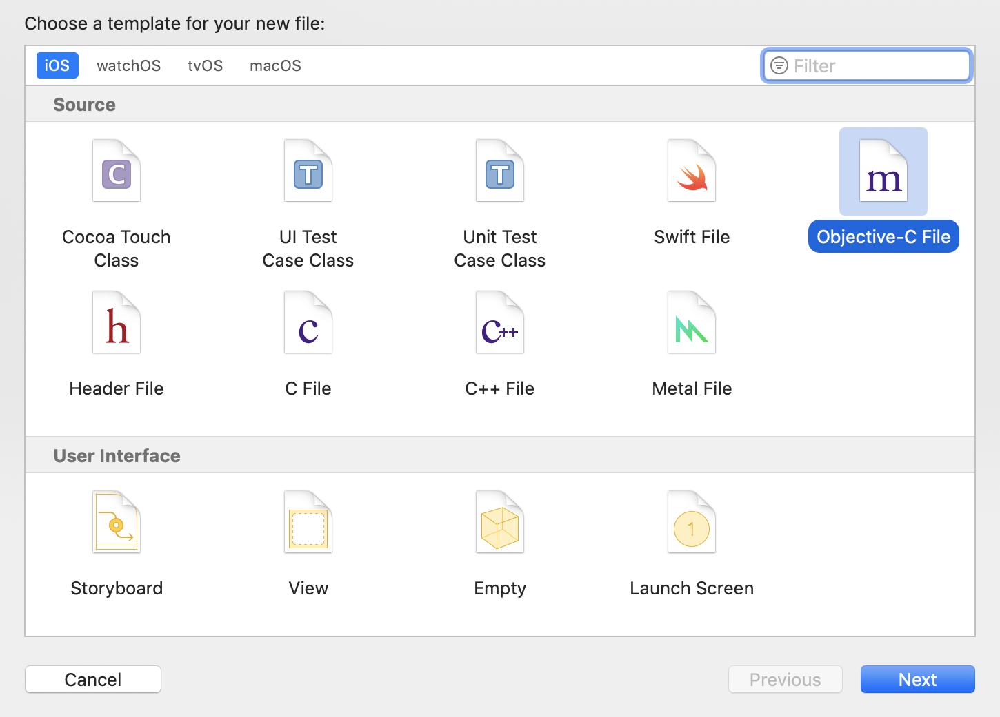
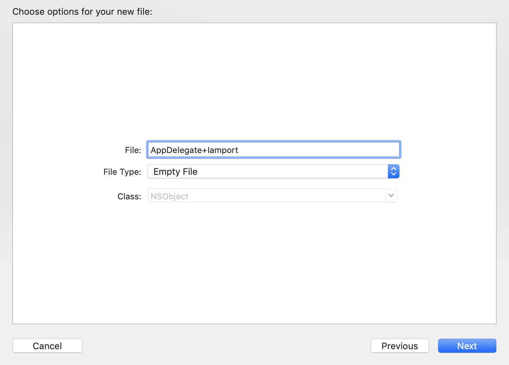
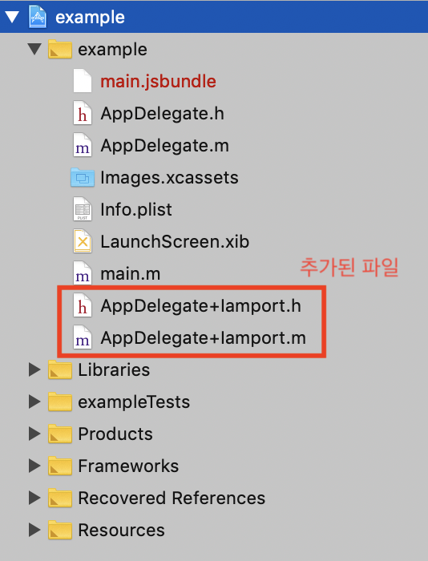

# 실시간 계좌이체 설정하기

## 1. IOS - 웹 표준 이니시스 또는 나이스 정보통신
IOS에서 `웹 표준 이니시스(이하 이니시스)` 또는 `나이스 정보통신(이하 나이스)` `실시간 계좌이체`를 연동하는 경우 별도 설정이 요구됩니다. 이니시스는 결제완료 후 콜백이 실행되지 않고, 나이스는 결제인증 후 결제완료 처리가 되지 않기 때문입니다. 이는 이니시스와 나이스 결제모듈 자체 문제입니다. 아임포트 RN 모듈은 이에 대응하기 위한 안내를 제공하고 있습니다.

### 실시간 계좌이체 결제처리 원리
먼저 뱅크페이 앱에서 귀하의 앱으로 복귀할때를 트리거해야 합니다. 아임포트 RN 모듈은 트리거 된 순간 이니시스의 경우 콜백을 실행시키고, 나이스의 경우 나이스로 결제정보가 담긴 POST 요청을 보냅니다. Objective C는 들어오는(incoming) 앱 링크를 트리거 하기 위해 `openURL` 메소드를 제공합니다. 이때 RN `Linking`을 활용해 RN단에서 들어오는 앱 링크를 트리거 하게 만들 수 있습니다. 자세한 내용은 [RN Linking](https://facebook.github.io/react-native/docs/linking)을 참고하세요.

### 프로젝트에 openURL 메소드 추가하기
프로젝트에 openURL 메소드를 추가하는 방법은 총 2가지입니다.

1.`*AppDelegate.m` 파일에 아래 코드를 복사합니다.

```objectivec
// iOS 9.x or newer
#import <React/RCTLinkingManager.h>

- (BOOL)application:(UIApplication *)application
   openURL:(NSURL *)url
   options:(NSDictionary<UIApplicationOpenURLOptionsKey,id> *)options
{
  return [RCTLinkingManager application:application openURL:url options:options];
}
```

```objectivec
// iOS 8.x or older
#import <React/RCTLinkingManager.h>

- (BOOL)application:(UIApplication *)application openURL:(NSURL *)url
  sourceApplication:(NSString *)sourceApplication annotation:(id)annotation
{
  return [RCTLinkingManager application:application openURL:url
                      sourceApplication:sourceApplication annotation:annotation];
}
```

2. 프로젝트에 아임포트 RN 모듈 예제 프로젝트 AppDelegate 파일을 추가합니다.
- Xcode 프로젝트를 오픈합니다.
- 왼쪽 프로젝트 네비게이터에서 타깃에 커서를 두고 마우스 오른쪽 버튼을 클릭합니다.
- 하위 메뉴에서 `New File...`을 클릭합니다.
- 아래와 같이 `Header File`을 선택하고 Next 버튼을 누릅니다.



- 파일 이름을 적는 란에 `AppDelegate+Iamport`를 입력하고 Create 버튼을 누릅니다.



- 생성된 `AppDelegate+Iamport.h` 파일에 아래 코드(iamport-react-native/example/ios/AppDelegate+Iamport.h와 동일)를 복사합니다.
```objectivec
#ifndef AppDelegate_Iamport_h
#define AppDelegate_Iamport_h

#import "AppDelegate.h"

@interface AppDelegate (프로젝트 이름 EX. example)

@end

#endif
```
- 같은 방식으로 타깃에서 마우스 오른쪽 버튼 클릭 후 `New File...`을 클릭합니다.
- 아래와 같이 `Objective-C File`을 클릭하고 Next 버튼을 누릅니다.



- 파일 이름을 적는 란에 `AppDelegate+Iamport`를 입력하고 Next 버튼을 누릅니다.



- 마지막 화면에서 Create 버튼을 누릅니다.
- 생성된 AppDelegate+Iamport.m 파일에 아래 코드(iamport-react-native/example/ios/AppDelegate+Iamport.m와 동일)를 복사합니다.

```objectivec
#import "AppDelegate+Iamport.h"
#import <React/RCTLinkingManager.h>

@implementation AppDelegate (프로젝트 이름 EX. example)

- (BOOL)application:(UIApplication *)application
            openURL:(NSURL *)url
            options:(NSDictionary<UIApplicationOpenURLOptionsKey,id> *)options
{
  return [RCTLinkingManager application:application openURL:url options:options];
}

@end
```
- 생성된 결과는 아래와 같습니다.



## 2. Android - 나이스 정보통신
Android에서는 `나이스` `실시간 계좌이체`를 연동하는 경우 IOS와 같은 이유로 별도 설정이 요구됩니다.

### 실시간 계좌이체 결제처리 원리
IOS와 동일하게 뱅크페이 앱에서 귀하의 앱으로 복귀할때를 트리거해야 합니다. 아임포트 RN 모듈은 트리거 된 순간 나이스로 결제정보가 담긴 POST 요청을 보냅니다. Java는 들어오는(incoming) 앱 링크를 트리거 하기 위해 deep linking 기능을 제공합니다.

### Intent Filter 추가하고 launchMode 설정하기
deep linking 기능을 활성화하기 위해 `Intent Filter`를 추가하고 `MainActivity`의 `launchMode`를 아래와 같이 `singleTask`로 설정해야 합니다. 자세한 내용은 [RN Linking](https://facebook.github.io/react-native/docs/linking)을 참고하세요.

```xml
..
<!-- [프로젝트 폴더]/android/app/src/main/AndroidManifest.xml -->.
<!-- MainActivity의 launchMode를 singleTask로 설정 -->
<activity
  android:name=".MainActivity"
  android:launchMode="singleTask"
>
  ...
  <!-- Intent Filter 추가 -->
  <intent-filter>
    <action android:name="android.intent.action.VIEW"/>
    <category android:name="android.intent.category.DEFAULT"/>
    <category android:name="android.intent.category.BROWSABLE"/>
    <data android:scheme="앱 스킴 값 EX. example" />
  </intent-filter>
</activity>
...
```